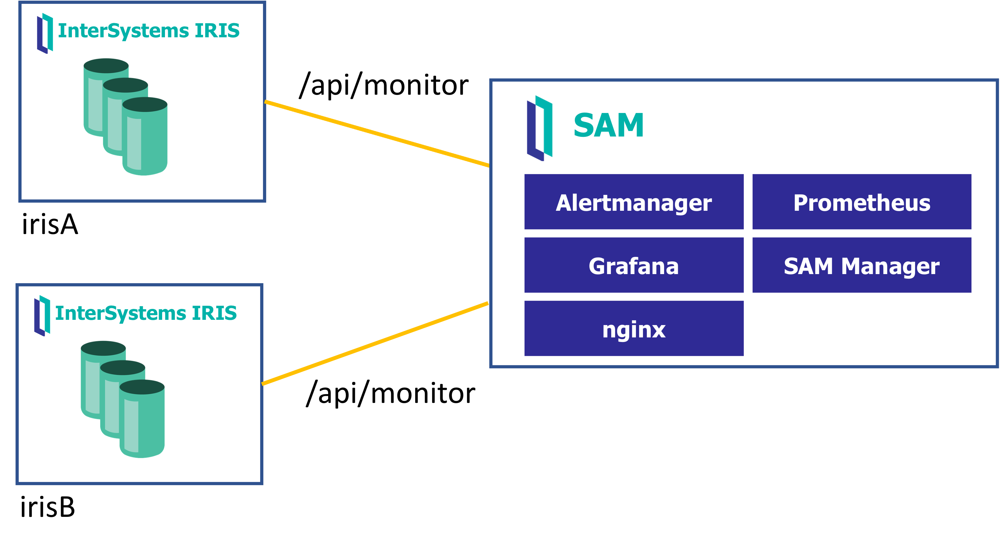
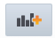

# Workshop: Monitoring IRIS instances using SAM
Workshop where you will learn how to monitor InterSystems IRIS instances using SAM (System Alerting and Monitoring).



# What do you need to install? 
* [Git](https://git-scm.com/downloads) 
* [Docker](https://www.docker.com/products/docker-desktop) (if you are using Windows, make sure you set your Docker installation to use "Linux containers").
* [Docker Compose](https://docs.docker.com/compose/install/)
* [Visual Studio Code](https://code.visualstudio.com/download) + [InterSystems ObjectScript VSCode Extension](https://marketplace.visualstudio.com/items?itemName=daimor.vscode-objectscript)

# Setup
1. Run some InterSystems IRIS instances that will be executing simple HL7 productions.
These are the instances we will monitor. You can access them at:
http://localhost:9191/csp/sys/UtilHome.csp (`superuser`/`SYS`)
http://localhost:9291/csp/sys/UtilHome.csp (`superuser`/`SYS`)

```
cd iris
docker-compose up -d
```

2. Now, run SAM (System Alerting and Monitoring). You can access SAM at:
http://localhost:8080/api/sam/app/index.csp (`superuser`/`SYS`)

```
cd sam-1.0.0.115-unix
docker-compose up -d
```

# Examples  

## (a). Creating a new cluster
Clusters are set of instances you want to monitor using SAM. So, you first must define a new cluster.

* Access SAM in http://localhost:8080/api/sam/app/index.csp using `superuser`/`SYS`. System will ask you to change the password.

* Click on *Create Your First Cluster*
Cluster name: `workshop-cluster`

## (b). Adding IRIS instances to monitor
After creating the cluster, you can add the instances you want to monitor.
As we will monitoring instances that are running as containers on the same host, we will use `host.docker.internal` as ip address.

* Click on `+New` Instances and irisA instance:
  * IP: `host.docker.internal`
  * Port: `9191`
  * Name: `irisA`

* Add irisB instance:
  * IP: `host.docker.internal`
  * Port: `9291`
  * Name: `irisB`

* After defining instances, acces the instance dashboard navigating `Clusters > workshop-cluster > instances`

## (c). Defining new cluster alert rules
IRIS alerts are automatically collected by SAM. However, you can add additional events that generate alerts using *Prometheus Query Language* expressions:

* Have a look at the available metrics for irisA instance: http://localhost:9191/api/monitor/metrics

* Check [Monitoring InterSystems IRIS using REST API](https://docs.intersystems.com/irislatest/csp/docbook/DocBook.UI.Page.cls?KEY=GCM_rest) for more information about `/api/monitor/metrics`

Let's create a new alert rule for a cluster:

* Go to SAM main page in http://localhost:8080/api/sam/app/index.csp 

* Select the `workshop-cluster` we have already defined and click `Edit Cluster`.

* Click on `+New` Alert rules:

  * Alert rule name: `iris_csp_gateway_latency greater than 1s`
  * Alert severity: `Warning`
  * Alert expression: `iris_csp_gateway_latency{cluster="workshop-cluster",id="127.0.0.1:52773"}>1.0`
  * Alert message: `Gateway latency is {{ $value }}`

Alerts will be displayed in the Alerts Panel and in the instance state, check [Understanding Instance State](https://docs.intersystems.com/sam/csp/docbook/DocBook.UI.Page.cls?KEY=ASAM#ASAM_use_instance_state).


## (d). Alert handling
You can create alert handlers to specify additional actions for SAM for an alert fires.

* Have a look at [AlertHandler](iris/src/Demo/AlertHandler.cls). You can use something similar to send text messages using Telegram or email.

* After creating the alert handler, you need to import it into SAM. We will use the Management Portal of the InterSystems IRIS instance that is included with SAM to import the handler.

  * Access http://localhost:8080/csp/sys/UtilHome.csp using `superuser` and password you defined for SAM.
  * `System Explorer > Classes > Namespace SAM > Import > My Local Machine` and import [AlertHandler](iris/src/Demo/AlertHandler.cls).


## (e). Grafana dashboard
The instance dashboard displays several metrics. This dasboard is generated using Grafana, an open-source metrics visualization tool. You can customize the dashboard as you need.

* Enter some instance dashboard and click on `View in Grafana`.
* Click on Add panel icon 
* Click on `Add Query`, choose `SAM Collector`.
* Choose some metric like `iris_csp_gateway_latency`.
* Legend: `{{instance}}`
* Then, play with some visualization options (e.g. Graph, Stat, Gauge, Heatmap, etc.)
* Finally, change panel title and save it.

Now, go back to SAM instance dashboard and check your changes.


## (f). Adding custom application metrics
You can add your own custom application metrics and show them in the dashboard or define alerts based on them.

Let's create a custom metric:

* Have a look at [Demo.Metrics.Pharma](iris/src/Demo/Metrics/Pharma.cls). This metric is simply counting the prescriptions that are processed in the HL7 production.

* Once the metric is developed, we must enable this, you can use WebTerminal to enter this command:

```objectscript
zn "%SYS"
write ##class(SYS.Monitor.SAM.Config).AddApplicationClass("Demo.Metrics.Pharma", "USER")
```

Be sure to run this in both instances ([irisA](http://localhost:9191/terminal/) and [irisB](http://localhost:9291/terminal/))

* Also, in this case as the metric is the `USER` namespace, add the `%DB_USER` resource to `/api/monitor` webb app. Once again, be sure to do that both in [irisA](http://localhost:9191/csp/sys/sec/%25CSP.UI.Portal.Applications.Web.zen?PID=%2Fapi%2Fmonitor) and [irisB](http://localhost:9291/csp/sys/sec/%25CSP.UI.Portal.Applications.Web.zen?PID=%2Fapi%2Fmonitor)

* Finally, check the available metrics now, you should have a new metric called `pharma_prescription`:
  * http://localhost:9191/api/monitor/metrics and
  * http://localhost:9291/api/monitor/metrics


